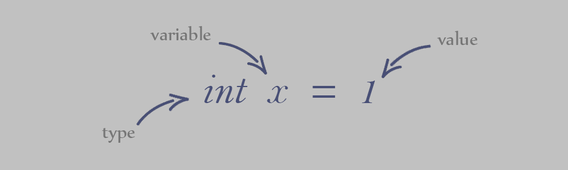

# 1-1 variable 變數



---
## **一、變數？代數？**
---
## **二、Python 的型態**

|  型態 |  意義   |  範例值   |
|-------|---------|----------|
|  int  |  整數   |   12     |
| float |  浮點數 |   11.1   |
|  str  |  字串   | "python" |
|  list |  陣列   |   [1,2]  |
...
---
## **三、變數設立與運算**
```py
x = 1
x = x+1
print(x)
```
輸出：
```
2
```
---
## **四、保留字限制**
***錯誤示範：***
```py
print = 1
```